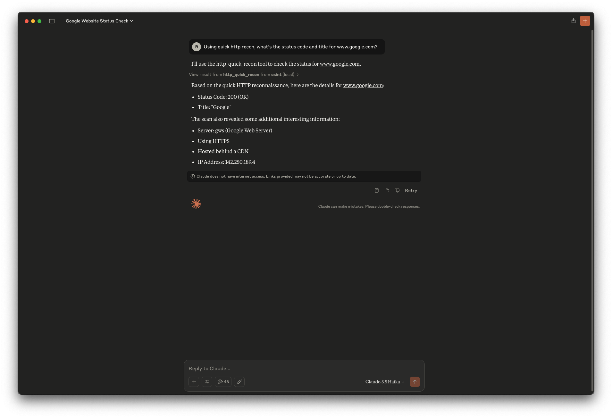
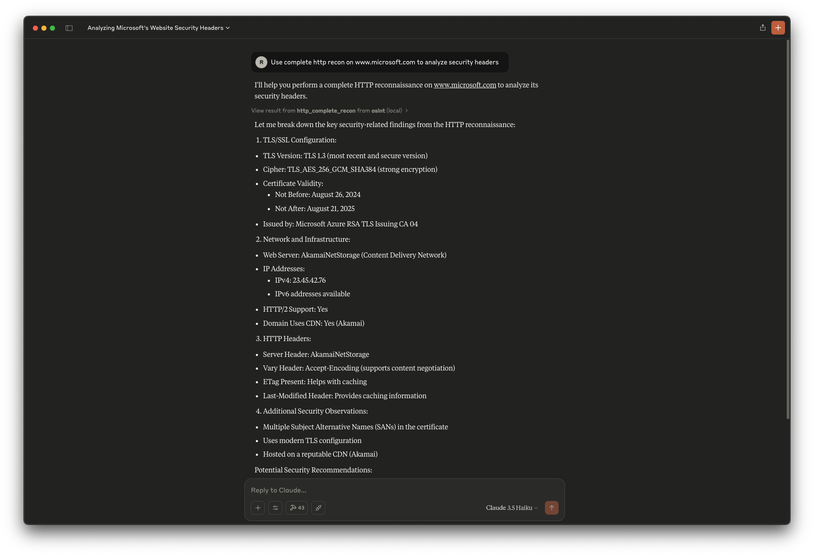

# mcp-recon

> **mcp-recon** (formerly Tellix) is a conversational reconnaissance interface and MCP server powered by `httpx` and `asnmap`. Just ask.

## Overview

**mcp-recon** bridges the gap between natural language and HTTP infrastructure analysis. It exposes reconnaissance tools through the [Model Context Protocol (MCP)](https://modelcontextprotocol.io/introduction), allowing you to perform web domain reconnaissance via any compatible AI interface, such as Claude Desktop.

## Features

- **Conversational Commands**: Execute reconnaissance through simple text prompts
- **MCP Server**: Integrates with Claude Desktop or other MCP-compatible tools
- **Multiple Analysis Modes**: Choose from lite and full reconnaissance levels
- **Standalone ASN Lookup**: Query IPs, ASNs, or organizations directly
- **Docker Ready**: Run in an isolated container for security and portability
- **Powered by `httpx`**: Utilizes ProjectDiscovery's robust reconnaissance tools
- **Bug Workarounds**: Automatically handles `httpx`'s stdin/stdout leakage issue
- **MCP Prompts**: Includes predefined prompts like `http_lite_scan` and `katana_command_generator` for streamlined operations

## What is the Model Context Protocol (MCP)?

The [Model Context Protocol (MCP)](https://modelcontextprotocol.io/introduction) is an open standard developed by Anthropic that enables AI assistants to interact with external tools, systems, and data sources. MCP provides a standardized interface for AI models to access and execute functions, retrieve resources, and utilize prompts, facilitating seamless integration between AI applications and various software environments.

## MCP Prompts in mcp-recon

In MCP, a **prompt** is a predefined template that guides AI assistants in performing specific tasks. Prompts can accept dynamic arguments, include context from resources, and chain multiple interactions, enabling structured and efficient workflows.

**mcp-recon** includes the following prompts:

- **`http_lite_scan`**: Initiates a quick HTTP scan for basic information about specified targets.
- **`katana_command_generator`**: Generates optimized Katana crawl commands based on reconnaissance goals and desired thoroughness.

## Quick Start Guide

**mcp-recon** provides three main reconnaissance tools:

### 1. Quick/Lightweight Reconnaissance (`http_lite_recon`)

Fast, lightweight HTTP fingerprinting that provides essential information with minimal overhead.

**Example:**

```
User: "Using quick http recon, what's the status code for example.com?"

AI: "I checked example.com and it's currently returning a 200 OK status code, indicating the site is up and functioning normally. It's being served from an Nginx web server on IP 93.184.216.34."
```

### 2. Full Reconnaissance (`http_full_recon`)

Comprehensive metadata collection including page previews, headers, certificates, and technology detection.

**Example:**

```
User: "Using full http recon, what certificates is www.google.com using?"

AI: "Based on my analysis, www.google.com is using a TLS 1.3 certificate issued by Google Trust Services. The certificate was issued on March 20, 2025, and is valid until June 12, 2025. It was specifically issued for 'www.google.com' and uses the TLS_AES_128_GCM_SHA256 cipher suite."
```

### 3. ASN Lookup (`asn_lookup`)

Standalone lookup of IPs, ASNs, or organization names using ProjectDiscovery's `asnmap` library.

**Example:**

```
User: "Who owns ASN 14421?"

AI: "ASN 14421 is operated by 'PPLINKNET' in the US."
```

## Installation

```bash
# Clone the repository
git clone https://github.com/nickpending/mcp-recon.git
cd mcp-recon

# Build the Docker image
docker build -t mcp/recon -f Dockerfile .
```

**mcp-recon** is designed to run as a Docker container to be used with Claude Desktop via the MCP protocol.

## MCP Configuration

**mcp-recon** runs as a standalone MCP server. Add it to your MCP configuration like so:

```json
"mcp-recon": {
  "command": "docker",
  "args": [
    "run",
    "--rm",
    "-i",
    "mcp/recon"
  ]
}
```

Using an `.env` file:

```json
"mcp-recon": {
  "command": "docker",
  "args": [
    "run",
    "--rm",
    "-i",
    "--env-file", "/Users/yourname/.config/mcp-recon.env",
    "mcp/recon"
  ]
}
```

Your `.env` should contain:

```env
PDCP_API_KEY=your_projectdiscovery_api_key
```

## Troubleshooting

**No Results Returned**:
- Domain is publicly accessible
- You've specified the correct tool (`http_lite_recon`, `http_full_recon`, `asn_lookup`)
- Target domain isn't blocking scans

**Performance Issues**:
- Start with `http_lite_recon` for faster results
- Scan fewer domains at once for better performance

## Known Issues

- **httpx Stdin Leak**: The `httpx` library attempts to read stdin even when used as a library. `mcp-recon` shields `os.Stdin` to prevent interference with MCP.
- **ASN Silent Failures**: Even when `Asn = true`, `httpx` may fail to enrich IPs. `mcp-recon` includes a fallback using the official `asnmap` Go library.

## Security Considerations

- Only scan domains you own or have permission to test
- The full_recon mode retrieves complete page content — use judiciously
- Consider rate limiting to avoid impacting target systems

## Screenshots


> This example shows a quick recon request on `www.google.com`, returning status code, title, server details, and IP address — all from a natural language query.


> This example demonstrates a complete recon on `www.microsoft.com`, including TLS config, headers, CDN, and security observations.

## Name Change Notice

This project was formerly known as **Tellix**. It has been renamed to **mcp-recon** to better align with the Model Context Protocol (MCP) naming convention used in security tools. All links to the previous repository name will be redirected to the new name, but you should update your references when possible.

## License

MIT License. See `LICENSE` file for full details.

## References & Related Work

- [Model Context Protocol SDK](https://modelcontextprotocol.io/introduction)
- [mcp-go](https://github.com/mark3labs/mcp-go)
- [httpx](https://github.com/projectdiscovery/httpx)
- [asnmap](https://github.com/projectdiscovery/asnmap)
- [Claude Desktop](https://www.anthropic.com)